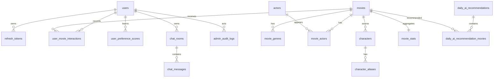

# Musubi B2 DB 테이블 문서

## 전체 테이블 요약

| 테이블 | 한 줄 설명 |
| --- | --- |
| `users` | 사용자 계정, 프로필 이미지, 화면 표시용 초기 선호 목록 |
| `refresh_tokens` | Refresh Token hash 저장/검증/폐기 |
| `movies` | 영화 기본 정보 |
| `movie_genres` | 영화 장르 정규화 테이블 |
| `actors` | 배우 기본 정보, TMDB 배우 ID, 프로필 이미지 경로 |
| `movie_actors` | 영화와 배우의 N:M 연결, 배역명, 출연 순서 |
| `characters` | 캐릭터 정보와 프롬프트 |
| `character_aliases` | `/chat/auto` 캐릭터 자동 매핑용 별칭 |
| `chat_rooms` | 채팅방 정보 |
| `chat_messages` | 채팅 메시지와 추천 영화 snapshot |
| `user_movie_interactions` | 사용자 영화 행동 원본 로그 |
| `user_preference_scores` | 추천 계산용 사용자 취향 점수 |
| `movie_stats` | 영화별 인기 랭킹 누적 통계 |
| `daily_ai_recommendations` | 날짜별 AI 추천 한 문장 묶음 |
| `daily_ai_recommendation_movies` | 데일리 추천 묶음과 영화 연결, 표시 순서 |
| `admin_audit_logs` | 관리자 작업 이력용 테이블, 현재 로직 미연결 |

## 관계 요약



## users

사용자 계정 기본 정보와 메인페이지/마이페이지 표시용 초기 선호 목록을 저장한다. 실제 추천 계산은 `user_preference_scores`가 담당한다.

| 컬럼 | 타입 | 키/제약 | 설명 |
| --- | --- | --- | --- |
| `id` | `BIGINT` | PK | 사용자 내부 ID |
| `email` | `VARCHAR(255)` | UNIQUE, INDEX, NOT NULL | 로그인 이메일 |
| `password_hash` | `VARCHAR(255)` | NOT NULL | 비밀번호 hash |
| `nickname` | `VARCHAR(50)` | NOT NULL | 사용자 닉네임 |
| `profile_image` | `VARCHAR(300)` | NULL | 프로필 이미지 상대경로 또는 storage key |
| `preferred_genres` | `ARRAY(String)` | NULL | 화면 표시용 선호 장르 목록 |
| `preferred_actors` | `ARRAY(String)` | NULL | 화면 표시용 선호 배우 목록 |
| `preferred_keywords` | `ARRAY(String)` | NULL | 화면 표시용 선호 키워드 목록 |
| `is_admin` | `BOOLEAN` | DEFAULT false, NOT NULL | 관리자 여부 |
| `created_at` | `TIMESTAMPTZ` | NOT NULL | 생성 시간 |
| `updated_at` | `TIMESTAMPTZ` | NOT NULL | 수정 시간 |

설계 메모:

- `preferred_*`는 사용자가 직접 선택한 표시용 값이다.
- 추천 계산용 점수는 `user_preference_scores`에 저장한다.
- 프로필 이미지 파일 자체는 DB에 저장하지 않고 경로만 저장한다.

## refresh_tokens

Refresh Token 원문이 아니라 hash를 저장한다. B1이 JWT 발급/검증 흐름을 담당하고, B2는 DB 저장/조회 로직을 제공한다.

| 컬럼 | 타입 | 키/제약 | 설명 |
| --- | --- | --- | --- |
| `id` | `UUID` | PK, DEFAULT `gen_random_uuid()` | Refresh Token row ID |
| `user_id` | `BIGINT` | FK -> `users.id`, ON DELETE CASCADE, INDEX, NOT NULL | 토큰 소유 사용자 |
| `token_hash` | `VARCHAR(255)` | UNIQUE, INDEX, NOT NULL | Refresh Token hash |
| `created_at` | `TIMESTAMPTZ` | NOT NULL | 생성 시간 |
| `expires_at` | `TIMESTAMPTZ` | NOT NULL | 만료 시간 |
| `revoked_at` | `TIMESTAMPTZ` | NULL | 로그아웃/폐기 시간 |
| `last_used_at` | `TIMESTAMPTZ` | NULL | 마지막 재발급 사용 시간 |
| `user_agent` | `TEXT` | NULL | 접속 브라우저/앱 정보 |

## movies

영화 기본 정보를 저장한다. CSV 원본 호환을 위해 `genres`, `cast` 배열도 유지하지만, 장르/배우 기능은 각각 `movie_genres`, `movie_actors`를 우선 사용한다.

| 컬럼 | 타입 | 키/제약 | 설명 |
| --- | --- | --- | --- |
| `id` | `BIGINT` | PK | 영화 내부 ID |
| `tmdb_id` | `INTEGER` | UNIQUE, INDEX, NULL | TMDB 영화 ID |
| `title` | `VARCHAR(300)` | INDEX, NOT NULL | 영화 제목 |
| `overview` | `TEXT` | NULL | 줄거리 |
| `genres` | `ARRAY(String)` | NULL | CSV 호환용 장르 배열 |
| `director` | `VARCHAR(200)` | NULL | 감독명 |
| `cast` | `ARRAY(String)` | NULL | CSV 호환용 배우명 배열 |
| `keywords` | `ARRAY(String)` | NULL | 키워드 배열 |
| `year` | `INTEGER` | NULL | 개봉 연도 |
| `release_date` | `DATE` | INDEX, NULL | 실제 개봉일. 최신순·최신성 계산 기준 |
| `runtime` | `INTEGER` | NULL | 상영시간(분) |
| `production_countries` | `ARRAY(String(2))` | NULL | ISO 3166-1 alpha-2 제작국가 코드 목록 |
| `certification` | `VARCHAR(20)` | NULL | 국가별 관람등급 |
| `certification_country` | `VARCHAR(2)` | NULL | 관람등급 기준 국가 코드(KR 우선, US 보조) |
| `language` | `VARCHAR(10)` | NULL | 언어 코드 |
| `vote_average` | `FLOAT` | NULL | 평점 |
| `vote_count` | `INTEGER` | NULL | 투표 수 |
| `audience_count` | `BIGINT` | NULL | 관객 수 |
| `poster_path` | `VARCHAR(300)` | NULL | TMDB 포스터 상대경로 |
| `last_synced_at` | `TIMESTAMPTZ` | NULL | 외부 데이터 마지막 동기화 시간 |
| `created_at` | `TIMESTAMPTZ` | NOT NULL | 생성 시간 |
| `updated_at` | `TIMESTAMPTZ` | NOT NULL | 수정 시간 |

## movie_genres

영화 장르를 정규화해서 저장한다. 장르 검색/추천/통계에 사용한다.

| 컬럼 | 타입 | 키/제약 | 설명 |
| --- | --- | --- | --- |
| `id` | `BIGINT` | PK | row ID |
| `movie_id` | `BIGINT` | FK -> `movies.id`, ON DELETE CASCADE, INDEX, NOT NULL | 영화 ID |
| `genre` | `VARCHAR(50)` | INDEX, NOT NULL | 장르명 |

제약:

```text
UNIQUE(movie_id, genre)
```

## actors

배우 기본 정보와 TMDB 프로필 이미지 경로를 저장한다.

| 컬럼 | 타입 | 키/제약 | 설명 |
| --- | --- | --- | --- |
| `id` | `BIGINT` | PK | 배우 내부 ID |
| `tmdb_actor_id` | `INTEGER` | UNIQUE, INDEX, NULL | TMDB person ID |
| `name` | `VARCHAR(100)` | INDEX, NOT NULL | 배우 이름 |
| `profile_path` | `VARCHAR(300)` | NULL | TMDB 프로필 이미지 상대경로 |
| `created_at` | `TIMESTAMPTZ` | NOT NULL | 생성 시간 |
| `updated_at` | `TIMESTAMPTZ` | NOT NULL | 수정 시간 |

## movie_actors

영화와 배우의 N:M 관계를 저장한다. 배우별 영화 모아보기, 영화 상세 출연진 조회에 사용한다.

| 컬럼 | 타입 | 키/제약 | 설명 |
| --- | --- | --- | --- |
| `id` | `BIGINT` | PK | 연결 row ID |
| `movie_id` | `BIGINT` | FK -> `movies.id`, ON DELETE CASCADE, INDEX, NOT NULL | 영화 ID |
| `actor_id` | `BIGINT` | FK -> `actors.id`, ON DELETE CASCADE, INDEX, NOT NULL | 배우 ID |
| `character_name` | `VARCHAR(150)` | NULL | 영화 내 배역명 |
| `cast_order` | `INTEGER` | NULL | TMDB 출연 순서 |

제약:

```text
UNIQUE(movie_id, actor_id)
```

## characters

캐릭터 대화 기능에서 사용하는 캐릭터 정보와 프롬프트를 저장한다.

| 컬럼 | 타입 | 키/제약 | 설명 |
| --- | --- | --- | --- |
| `id` | `BIGINT` | PK | 캐릭터 ID |
| `movie_id` | `BIGINT` | FK -> `movies.id`, ON DELETE SET NULL, NULL | 연결 영화 ID |
| `name` | `VARCHAR(100)` | INDEX, NOT NULL | 정식 캐릭터명 |
| `movie_title` | `VARCHAR(200)` | NOT NULL | 출처 영화 제목 |
| `actor` | `VARCHAR(100)` | NULL | 배우명 |
| `lang` | `VARCHAR(10)` | NOT NULL | 언어 코드 |
| `system_prompt` | `TEXT` | NOT NULL | 캐릭터 프롬프트 |
| `profile_image` | `VARCHAR(300)` | NULL | 캐릭터 이미지 경로 |
| `is_active` | `BOOLEAN` | DEFAULT true, NOT NULL | 사용 여부 |
| `created_at` | `TIMESTAMPTZ` | NOT NULL | 생성 시간 |
| `updated_at` | `TIMESTAMPTZ` | NOT NULL | 수정 시간 |

## character_aliases

`/chat/auto`에서 사용자 메시지에 나온 별칭을 정식 캐릭터명으로 매핑하기 위한 테이블이다.

| 컬럼 | 타입 | 키/제약 | 설명 |
| --- | --- | --- | --- |
| `id` | `BIGINT` | PK | 별칭 row ID |
| `character_id` | `BIGINT` | FK -> `characters.id`, ON DELETE CASCADE, INDEX, NOT NULL | 캐릭터 ID |
| `alias` | `VARCHAR(100)` | UNIQUE, INDEX, NOT NULL | 별칭 |

## chat_rooms

채팅방 정보를 저장한다.

| 컬럼 | 타입 | 키/제약 | 설명 |
| --- | --- | --- | --- |
| `id` | `BIGINT` | PK | 채팅방 ID |
| `user_id` | `BIGINT` | FK -> `users.id`, ON DELETE CASCADE, INDEX, NOT NULL | 사용자 ID |
| `room_type` | `VARCHAR(20)` | CHECK, NOT NULL | `general`, `character`, `group` |
| `characters` | `ARRAY(String)` | NULL | 참여 캐릭터명 목록 |
| `created_at` | `TIMESTAMPTZ` | NOT NULL | 생성 시간 |
| `updated_at` | `TIMESTAMPTZ` | NOT NULL | 수정 시간 |

제약:

```text
room_type IN ('general', 'character', 'group')
```

## chat_messages

채팅 메시지를 저장한다. 추천 영화 카드는 대화 복원을 위해 JSONB snapshot으로 저장한다.

| 컬럼 | 타입 | 키/제약 | 설명 |
| --- | --- | --- | --- |
| `id` | `BIGINT` | PK | 메시지 ID |
| `room_id` | `BIGINT` | FK -> `chat_rooms.id`, ON DELETE CASCADE, INDEX, NOT NULL | 채팅방 ID |
| `role` | `VARCHAR(20)` | CHECK, NOT NULL | `user`, `assistant` |
| `character_name` | `VARCHAR(100)` | NULL | 응답 캐릭터명 |
| `content` | `TEXT` | NOT NULL | 메시지 본문 |
| `recommended_movies` | `JSONB` | NULL | 대화 당시 추천 영화 snapshot |
| `created_at` | `TIMESTAMPTZ` | NOT NULL | 생성 시간 |

제약:

```text
role IN ('user', 'assistant')
```

## user_movie_interactions

사용자 행동 원본 로그다. 조회 기록, 좋아요 기록, 랭킹 집계, 취향 학습의 근거로 사용한다.

| 컬럼 | 타입 | 키/제약 | 설명 |
| --- | --- | --- | --- |
| `id` | `BIGINT` | PK | 행동 로그 ID |
| `user_id` | `BIGINT` | FK -> `users.id`, ON DELETE CASCADE, INDEX, NOT NULL | 사용자 ID |
| `movie_id` | `BIGINT` | FK -> `movies.id`, ON DELETE CASCADE, INDEX, NOT NULL | 영화 ID |
| `action_type` | `VARCHAR(20)` | CHECK, NOT NULL | `view`, `search_click`, `like` |
| `source` | `VARCHAR(20)` | CHECK, DEFAULT unknown, NOT NULL | 유입 경로 |
| `score_delta` | `INTEGER` | NOT NULL | 랭킹 반영 점수 |
| `created_at` | `TIMESTAMPTZ` | NOT NULL | 행동 시간 |

제약:

```text
action_type IN ('view', 'search_click', 'like')
source IN ('direct', 'search', 'recommend', 'ranking', 'admin', 'unknown')
```

## user_preference_scores

사용자 행동을 분석해 누적한 추천 계산용 취향 점수다.

| 컬럼 | 타입 | 키/제약 | 설명 |
| --- | --- | --- | --- |
| `id` | `BIGINT` | PK | 취향 점수 row ID |
| `user_id` | `BIGINT` | FK -> `users.id`, ON DELETE CASCADE, INDEX, NOT NULL | 사용자 ID |
| `preference_type` | `VARCHAR(20)` | CHECK, NOT NULL | 취향 타입 |
| `preference_value` | `VARCHAR(200)` | NOT NULL | 취향 값 |
| `score` | `FLOAT` | DEFAULT 0, NOT NULL | 누적 점수 |
| `created_at` | `TIMESTAMPTZ` | NOT NULL | 생성 시간 |
| `updated_at` | `TIMESTAMPTZ` | NOT NULL | 수정 시간 |

제약:

```text
preference_type IN ('genre', 'actor', 'director', 'keyword', 'language', 'character')
UNIQUE(user_id, preference_type, preference_value)
```

## movie_stats

영화별 실시간 인기 랭킹 집계용 누적 통계다.

| 컬럼 | 타입 | 키/제약 | 설명 |
| --- | --- | --- | --- |
| `movie_id` | `BIGINT` | PK, FK -> `movies.id`, ON DELETE CASCADE | 영화 ID |
| `view_count` | `INTEGER` | DEFAULT 0, NOT NULL | 조회 수 |
| `search_click_count` | `INTEGER` | DEFAULT 0, NOT NULL | 검색 후 조회 수 |
| `like_count` | `INTEGER` | DEFAULT 0, NOT NULL | 좋아요 수 |
| `ranking_score` | `INTEGER` | DEFAULT 0, INDEX, NOT NULL | 랭킹 점수 |
| `created_at` | `TIMESTAMPTZ` | NOT NULL | 생성 시간 |
| `updated_at` | `TIMESTAMPTZ` | NOT NULL | 수정 시간 |

현재 랭킹 점수 기준:

```text
view +1
search_click +1
like +2
```

## daily_ai_recommendations

AI가 하루 단위로 생성한 추천 한 문장 묶음을 저장한다. `updated_at`은 사용하지 않는다.

| 컬럼 | 타입 | 키/제약 | 설명 |
| --- | --- | --- | --- |
| `id` | `BIGINT` | PK | 데일리 추천 묶음 ID |
| `recommend_date` | `DATE` | UNIQUE, INDEX, NOT NULL | 추천 날짜, 한국 기준 |
| `answer` | `TEXT` | NOT NULL | AI가 준 오늘의 한 문장 |
| `created_at` | `TIMESTAMPTZ` | NOT NULL | 생성 시간 |

## daily_ai_recommendation_movies

데일리 추천 묶음에 포함된 추천 영화와 카드 표시 순서를 저장한다.

| 컬럼 | 타입 | 키/제약 | 설명 |
| --- | --- | --- | --- |
| `daily_recommendation_id` | `BIGINT` | PK, FK -> `daily_ai_recommendations.id`, ON DELETE CASCADE | 데일리 추천 묶음 ID |
| `movie_id` | `BIGINT` | PK, FK -> `movies.id`, ON DELETE CASCADE | 추천 영화 ID |
| `display_order` | `INTEGER` | CHECK, NOT NULL | 카드 표시 순서, 1~3 |

제약:

```text
PRIMARY KEY(daily_recommendation_id, movie_id)
UNIQUE(daily_recommendation_id, display_order)
display_order BETWEEN 1 AND 3
```

설계 메모:

- AI가 `tmdb_id`를 주면 저장 전 `movies.tmdb_id`로 내부 `movies.id`를 찾아서 저장한다.
- 화면 조회 시에는 `movies`와 조인해서 포스터, 제목, 개요를 가져온다.
- AI 원본 응답 JSON은 현재 저장하지 않는다.

## tmdb_daily_sync_runs

TMDB 일일 증분 수집의 날짜별 실행 상태와 처리 건수를 저장한다.

| 컬럼 | 타입 | 키/제약 | 설명 |
| --- | --- | --- | --- |
| `sync_date` | `DATE` | PK | 수집 대상 날짜 |
| `status` | `VARCHAR(20)` | NOT NULL | running, partial, completed, failed |
| `changed_count` | `INTEGER` | NOT NULL | 처리 대상 수 |
| `imported_count` | `INTEGER` | NOT NULL | 신규 등록 수 |
| `updated_count` | `INTEGER` | NOT NULL | 기존 갱신 수 |
| `deleted_count` | `INTEGER` | NOT NULL | 삭제 수 |
| `failed_count` | `INTEGER` | NOT NULL | 실패 수 |
| `last_error` | `TEXT` | NULL | 실행 단계 오류 |
| `started_at` | `TIMESTAMPTZ` | NOT NULL | 시작 시간 |
| `completed_at` | `TIMESTAMPTZ` | NULL | 완료 시간 |

## movie_vector_sync_jobs

PostgreSQL 반영 이후 Milvus에 전달할 증분 작업 대기열이다.

| 컬럼 | 타입 | 키/제약 | 설명 |
| --- | --- | --- | --- |
| `id` | `BIGINT` | PK | 작업 ID |
| `tmdb_id` | `INTEGER` | UNIQUE, INDEX, NOT NULL | PostgreSQL–Milvus 공통 식별자 |
| `movie_id` | `BIGINT` | FK -> `movies.id`, ON DELETE SET NULL | 내부 영화 ID |
| `operation` | `VARCHAR(10)` | NOT NULL | upsert 또는 delete |
| `status` | `VARCHAR(20)` | INDEX, NOT NULL | pending, failed, completed |
| `attempts` | `INTEGER` | NOT NULL | 전송 시도 횟수 |
| `last_error` | `TEXT` | NULL | 최근 전송 오류 |
| `created_at` | `TIMESTAMPTZ` | NOT NULL | 생성 시간 |
| `updated_at` | `TIMESTAMPTZ` | NOT NULL | 최근 변경 시간 |
| `completed_at` | `TIMESTAMPTZ` | NULL | Milvus 반영 완료 시간 |

## admin_audit_logs

관리자 작업 이력 저장용 테이블이다. 현재는 테이블만 있고 실제 로직에는 아직 연결하지 않았다.

| 컬럼 | 타입 | 키/제약 | 설명 |
| --- | --- | --- | --- |
| `id` | `BIGINT` | PK | 관리자 이력 ID |
| `admin_user_id` | `BIGINT` | FK -> `users.id`, ON DELETE SET NULL, NULL | 작업 관리자 ID |
| `target_table` | `VARCHAR(100)` | NOT NULL | 대상 테이블명 |
| `target_id` | `BIGINT` | NULL | 대상 row ID |
| `action` | `VARCHAR(50)` | NOT NULL | 작업 종류 |
| `before_data` | `TEXT` | NULL | 변경 전 데이터 |
| `after_data` | `TEXT` | NULL | 변경 후 데이터 |
| `created_at` | `TIMESTAMPTZ` | NOT NULL | 작업 시간 |

## 주요 설계 기준

- 이미지 파일은 DB에 직접 저장하지 않고 `profile_image`, `profile_path`, `poster_path` 같은 경로만 저장한다.
- 영화 장르와 배우는 검색/추천/모아보기 기능 때문에 정규화 테이블을 사용한다.
- `user_movie_interactions`는 원본 행동 로그, `user_preference_scores`는 행동을 해석한 추천용 결과다.
- 데일리 AI 추천은 원본 JSON이 아니라 내부 `movie_id` 관계로 저장한다.
- `movies.genres`, `movies.cast`는 CSV 원본 호환용으로 유지한다.
