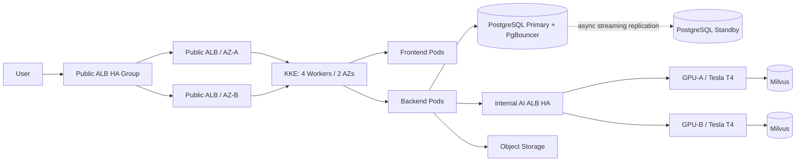

# Musubi — AI Movie Recommendation and Character Conversation Platform

[](https://github.com/dnddlek8275/Musubi-Movie-Recommended-Site/actions/workflows/ci.yaml)

Musubi is a web platform for movie discovery, personalized recommendations, reviews and activity tracking, AI-assisted movie recommendations, and conversations with movie characters. This monorepo contains the React and FastAPI applications, GPU-backed RAG/LLM services, and KakaoCloud deployment configuration.

- Service: [movieverse.cloud](https://movieverse.cloud)
- Production reference branch: `main`
- Infrastructure snapshot: August 19, 2026

## Features

- Faceted movie search by title, genre, actor, director, and keyword
- Personalized recommendations based on onboarding preferences, views, searches, likes, watchlists, and ratings
- Likes, watchlists, half-star ratings, spoiler-aware reviews, and recent activity management
- General conversations with Mumu and one-on-one or group conversations with supported movie characters
- Movie recommendation responses backed by Milvus RAG and Gemma 4 12B
- Scheduled synchronization of TMDB and KOBIS movie and box-office data
- Email verification, password reset, JWT authentication, and administration features

## Production Architecture



The frontend and backend run in a private KKE cluster across four workers in two availability zones. External traffic passes through the public Application Load Balancers and HA group before reaching ingress-nginx. AI workloads run separately on two Tesla T4 VMs behind an internal ALB. PostgreSQL runs on a dedicated primary VM with an AZ-B standby, asynchronous streaming replication, and a documented manual promotion procedure.

See the [multi-AZ architecture document](Infra/project-docs/current/infra/multi-az-architecture.md) for the current detailed status and completion criteria.

## Tech Stack

| Area | Technologies |
| --- | --- |
| Frontend | React 19, Vite 6, JavaScript, CSS, Nginx |
| Backend | Python, FastAPI, SQLAlchemy, Alembic, Pydantic, JWT |
| Database | PostgreSQL, PgBouncer, Object Storage backups |
| AI | Gemma 4 12B GGUF, llama.cpp, Milvus, FlagEmbedding, CrossEncoder |
| Infrastructure | KakaoCloud, KKE, ALB, Kubernetes, ingress-nginx, Docker, Kustomize |
| Delivery | GitHub Actions, Container Registry, operator-approved deployment |

## Repository Structure

```text
.
├── AI/          # RAG, recommendation and conversation pipelines, GPU API, evaluation
├── Backend/     # FastAPI, authentication, data access, PostgreSQL integration
├── Frontend/    # React web application and Nginx configuration
├── Infra/       # Kubernetes, cloud documentation, tools, and local Compose
└── README.md
```

The repository also maintains `.github/` for CI/CD and `.gitignore` rules for sensitive or generated files. Production credentials, API keys, SSH keys, model weights, and data files are not committed.

## Local Development

Docker Desktop or Docker Engine with Docker Compose is required. Copy the relevant `.env.example` files and provide the required environment values before starting the services.

```bash
docker compose -f Infra/compose.yaml up -d --build
```

| Service | Address |
| --- | --- |
| Web application | `http://localhost:8088` |
| Backend API | `http://localhost:8080` |
| Swagger UI | `http://localhost:8080/docs` |
| Health check | `http://localhost:8080/health` |

Stop the local stack with:

```bash
docker compose -f Infra/compose.yaml down
```

## Component Documentation

- [Frontend](Frontend/README.md)
- [Backend](Backend/README.md)
- [AI](AI/README.md)
- [Infrastructure](Infra/README.md)
- [Project documentation](Infra/project-docs/README.md)

## CI/CD

GitHub Actions validates the frontend and backend, builds production images, and pushes them to the container registry. Production Kubernetes deployment is operator-approved after reviewing image tags, database migrations, and service health.

## Operating Principles

- `main` is the reference branch for release, presentation, and production.
- Changes are validated in `dev` before being integrated into `main`.
- Secrets, SSH keys, GGUF models, production databases, and Milvus data are never committed.
- Production AI models and vector data are managed on the GPU servers under a separate backup policy.
- When documentation conflicts, the running code and `Infra/project-docs/current/` take precedence.
