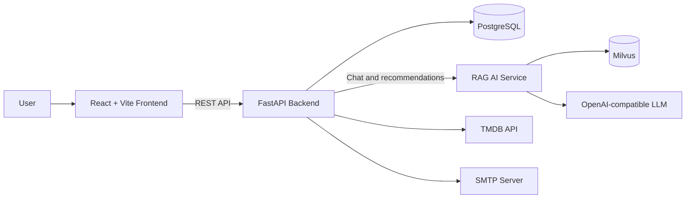

# Musubi — Character-Driven Movie Recommendation Platform

Musubi is a full-stack movie discovery and recommendation platform that combines personalized browsing with RAG-powered conversations in the voices of movie characters.

The integrated application is maintained on the [`dev` branch](https://github.com/dnddlek8275/Musubi-Movie-Recommended-Site/tree/dev). The default `main` branch provides this project overview.

## Key Features

- Search movies by title, genre, actor, director, keyword, and language
- Receive recommendations based on preferences and interaction history
- Chat one-on-one or in groups with supported movie characters
- Route conversations between character chat and movie recommendation flows
- Track popular movies, likes, views, recent activity, and daily recommendations
- Manage accounts with JWT authentication, email verification, and password reset
- Operate movie content and administrator roles through an admin interface
- Register and enrich movie metadata through TMDB integration
- Use speech-to-text input through the backend audio API

## Architecture



The frontend calls the backend through the same-origin `/api` path in the containerized environment. The backend owns authentication, movie data, user activity, recommendation records, and service orchestration. The AI service handles intent routing, query rewriting, embedding retrieval, reranking, and character-aware response generation.

## Technology Stack

| Area | Technologies |
| --- | --- |
| Frontend | React 19, Vite 6, JavaScript, CSS, Nginx |
| Backend | Python 3.12+, FastAPI, SQLAlchemy 2, Alembic, Pydantic, JWT |
| Database | PostgreSQL 17 |
| AI | RAG, Milvus, FlagEmbedding, Sentence Transformers, reranking, OpenAI-compatible LLM API |
| External services | TMDB API, SMTP |
| Infrastructure | Docker, Docker Compose, Kubernetes, Kustomize |
| CI/CD | GitHub Actions, Docker Buildx, container registry deployment |

## Repository Structure

The combined source is available on the `dev` branch:

```text
.
├── Frontend/          # React application and Nginx configuration
├── Backend/           # FastAPI API, models, migrations, and services
├── AI/                # RAG pipelines, retrievers, evaluation, and training tools
├── Infra/             # Kubernetes manifests and deployment scripts
├── Add-on/            # Optional TTS and GPU monitoring prototypes
├── docs/              # Current, reference, and archived documents
├── .github/workflows/ # CI and production release workflows
└── compose.yaml       # Local integrated environment
```

| Branch | Purpose |
| --- | --- |
| [`frontend`](https://github.com/dnddlek8275/Musubi-Movie-Recommended-Site/tree/frontend) | Frontend development |
| [`backend`](https://github.com/dnddlek8275/Musubi-Movie-Recommended-Site/tree/backend) | Backend and database development |
| [`ai`](https://github.com/dnddlek8275/Musubi-Movie-Recommended-Site/tree/ai) | AI and RAG development |
| [`infra`](https://github.com/dnddlek8275/Musubi-Movie-Recommended-Site/tree/infra) | Infrastructure work |
| [`dev`](https://github.com/dnddlek8275/Musubi-Movie-Recommended-Site/tree/dev) | Integrated application |

## Run the Integrated Application

### Prerequisites

- Docker
- Docker Compose
- A reachable Musubi AI service for chat and AI-powered recommendations

### 1. Clone the repository and switch to `dev`

```bash
git clone https://github.com/dnddlek8275/Musubi-Movie-Recommended-Site.git
cd Musubi-Movie-Recommended-Site
git checkout dev
```

### 2. Configure runtime values

The Compose file provides local defaults. Override secrets and service addresses when needed:

```bash
export POSTGRES_PASSWORD="your-local-password"
export SECRET_KEY="replace-with-a-long-random-secret"
export AI_BASE_URL="http://your-ai-service"
```

Mail and TMDB-dependent features require the corresponding values documented in [`Backend/.env.example`](https://github.com/dnddlek8275/Musubi-Movie-Recommended-Site/blob/dev/Backend/.env.example).

### 3. Start the services

```bash
docker compose up --build
```

Compose starts PostgreSQL, applies Alembic migrations, and then starts the backend and frontend.

| Service | Address |
| --- | --- |
| Web application | [http://localhost:8088](http://localhost:8088) |
| Backend API | [http://localhost:8080](http://localhost:8080) |
| Swagger UI | [http://localhost:8080/docs](http://localhost:8080/docs) |
| Health check | [http://localhost:8080/health](http://localhost:8080/health) |

AI-dependent requests will fail if the configured AI service is unavailable.

## Component Documentation

- [Frontend guide](https://github.com/dnddlek8275/Musubi-Movie-Recommended-Site/blob/dev/Frontend/README.md)
- [Backend guide](https://github.com/dnddlek8275/Musubi-Movie-Recommended-Site/blob/dev/Backend/README.md)
- [AI guide](https://github.com/dnddlek8275/Musubi-Movie-Recommended-Site/blob/dev/AI/README.md)
- [Infrastructure guide](https://github.com/dnddlek8275/Musubi-Movie-Recommended-Site/blob/dev/Infra/README.md)
- [Project documentation index](https://github.com/dnddlek8275/Musubi-Movie-Recommended-Site/blob/dev/docs/README.md)

## CI/CD

Pull requests and pushes to `dev` run frontend builds and dependency audits, backend compilation and tests, database migration and integration checks, container builds, and Kubernetes manifest validation.

Production deployment uses a manually confirmed GitHub Actions workflow that builds immutable images, verifies cluster prerequisites, runs database migrations, and performs Kubernetes rollouts.

## Security Notes

- Do not commit `.env` files, database credentials, JWT secrets, mail credentials, or API tokens.
- Use deployment-platform secrets for production.
- Set `REFRESH_COOKIE_SECURE=true` behind HTTPS.
- Back up PostgreSQL before production migrations.
- Persist and back up the backend upload volume.

## Project Status

The application is under active development. Integration changes are collected in `dev` before they are promoted to `main`.
