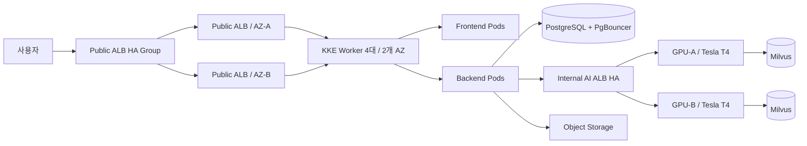

# Musubi — AI 영화 추천·캐릭터 대화 플랫폼

[](https://github.com/dnddlek8275/Musubi-Movie-Recommended-Site/actions/workflows/ci.yaml)

Musubi는 영화 탐색과 개인화 추천, 리뷰·활동 기록, AI 영화 추천 및 영화
캐릭터 대화를 제공하는 웹 서비스입니다. React·FastAPI 애플리케이션과
GPU 기반 RAG/LLM 서비스, KakaoCloud 배포 구성을 하나의 저장소에서
관리합니다.

- 서비스: [movieverse.cloud](https://movieverse.cloud)
- 운영 기준 브랜치: `main`
- 인프라 기준일: 2026-08-18

## 주요 기능

- 제목·장르·배우·감독·키워드 기반 분류형 영화 검색
- 온보딩 취향, 조회·검색·좋아요·찜·별점을 반영한 개인화 추천
- 영화 좋아요·찜·0.5점 단위 별점·스포일러 리뷰·최근 활동 관리
- 무무 일반 대화와 영화 캐릭터 1:1·그룹 대화
- Milvus RAG와 Gemma 4 12B 기반 영화 추천 응답
- TMDB·KOBIS 영화·박스오피스 데이터 정기 동기화
- 이메일 인증, 비밀번호 재설정, JWT 기반 인증과 관리자 기능

## 운영 아키텍처



Frontend와 Backend는 Private KKE Cluster에서 실행하며 두 가용 영역의
Worker 4대에 분산합니다. 외부 트래픽은 Public Application Load Balancer
A/B와 HA Group을 거쳐 ingress-nginx로 전달됩니다. AI 서비스는 두 대의
Tesla T4 전용 VM과 Internal ALB로 분리합니다. PostgreSQL Primary는 전용
VM에서 운영하고 AZ-B Standby와 수동 승격 절차를 포함한 멀티 AZ 인프라
구성을 완료했습니다. 운영 상태는 정기 점검과 모니터링으로 관리합니다.

현재 세부 상태와 완료 판정 기준은
[멀티 AZ 아키텍처 문서](Infra/project-docs/current/infra/multi-az-architecture.md)를
기준으로 합니다.

## 기술 스택

| 영역 | 기술 |
| --- | --- |
| Frontend | React 19, Vite 6, JavaScript, CSS, Nginx |
| Backend | Python, FastAPI, SQLAlchemy, Alembic, Pydantic, JWT |
| Database | PostgreSQL, PgBouncer, Object Storage 백업 |
| AI | Gemma 4 12B GGUF, llama.cpp, Milvus, FlagEmbedding, CrossEncoder |
| Infrastructure | KakaoCloud, KKE, ALB, Kubernetes, ingress-nginx, Docker, Kustomize |
| Delivery | GitHub Actions, Container Registry, 운영자 승인 배포 |

## 저장소 구성

```text
.
├── AI/          # RAG, 추천·대화 파이프라인, GPU AI API와 평가
├── Backend/     # FastAPI API, 인증, 데이터·PostgreSQL 연동
├── Frontend/    # React 웹 애플리케이션과 Nginx 구성
├── Infra/       # Kubernetes, 클라우드 문서, 보조 도구와 로컬 Compose
└── README.md
```

CI/CD에 필요한 `.github/`와 비밀정보 제외 규칙인 `.gitignore`도 함께
유지합니다. 운영 비밀번호, API 키, SSH 키, 모델 가중치와 데이터 파일은
저장소에 포함하지 않습니다.

## 로컬 통합 실행

Docker Desktop 또는 Docker Engine과 Docker Compose가 필요합니다. 환경값은
각 구성 요소의 `.env.example`을 복사해 입력합니다.

```bash
docker compose -f Infra/compose.yaml up -d --build
```

| 서비스 | 주소 |
| --- | --- |
| 웹 애플리케이션 | `http://localhost:8088` |
| Backend API | `http://localhost:8080` |
| Swagger UI | `http://localhost:8080/docs` |
| Health Check | `http://localhost:8080/health` |

종료:

```bash
docker compose -f Infra/compose.yaml down
```

## 구성 요소별 안내

- [Frontend](Frontend/README.md)
- [Backend](Backend/README.md)
- [AI](AI/README.md)
- [Infrastructure](Infra/README.md)
- [프로젝트 문서](Infra/project-docs/README.md)

## CI/CD

GitHub Actions는 Frontend·Backend 검사와 운영 이미지 빌드 및 Container
Registry Push를 담당합니다. Kubernetes 운영 배포는 이미지 태그,
데이터베이스 마이그레이션과 상태 확인을 검토한 뒤 운영자가 승인하여
진행합니다.

## 운영 원칙

- `main`을 제출·발표·운영 기준 브랜치로 사용합니다.
- 다음 변경은 `dev`에서 검증한 뒤 `main`으로 반영합니다.
- 비밀정보, SSH 키, GGUF 모델, 운영 DB와 Milvus 데이터는 커밋하지 않습니다.
- AI 운영 모델과 벡터 데이터는 GPU 서버 및 별도 백업 정책으로 관리합니다.
- 문서가 충돌하면 실행 중인 코드와 `Infra/project-docs/current/`를 우선합니다.
