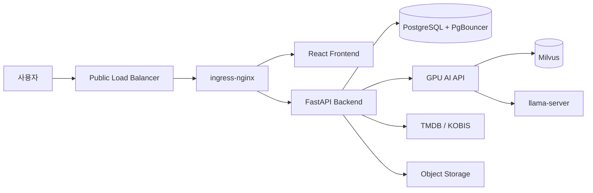

# Musubi — AI 영화 추천·캐릭터 대화 플랫폼

[](https://github.com/dnddlek8275/Musubi-Movie-Recommended-Site/actions/workflows/ci.yaml)

Musubi는 영화 탐색, 개인화 추천, 리뷰·활동 기록, AI 영화 추천 및 영화
캐릭터 대화를 제공하는 웹 서비스입니다. 애플리케이션과 배포 구성을 하나의
monorepo에서 관리합니다.

- 팀명: 무스비
- 서비스: [movieverse.cloud](https://movieverse.cloud)
- 기준 브랜치: `main`

## 주요 기능

- 제목·장르·배우·감독·키워드 기반 영화 탐색
- 온보딩 취향과 사용자 행동을 반영한 개인화 추천
- 영화 좋아요·찜·별점·리뷰 및 최근 활동 관리
- 무무 일반 대화와 영화 캐릭터 1:1·그룹 대화
- RAG 검색과 자체 LLM을 이용한 영화 추천 응답
- TMDB·KOBIS 데이터 동기화와 관리자 기능
- 이메일 인증, 비밀번호 재설정, JWT 기반 인증

## 아키텍처



운영 환경은 KakaoCloud의 Private Kubernetes Cluster에서 Frontend와
Backend를 실행하고, PostgreSQL과 Tesla T4 기반 AI 서비스는 전용 VM으로
분리합니다. 외부 요청은 Public Load Balancer와 ingress-nginx를 거쳐
서비스로 전달됩니다.

## 기술 스택

| 영역 | 기술 |
| --- | --- |
| Frontend | React 19, Vite 6, JavaScript, CSS, Nginx |
| Backend | Python, FastAPI, SQLAlchemy, Alembic, Pydantic, JWT |
| Database | PostgreSQL, PgBouncer |
| AI | RAG, Milvus, FlagEmbedding, CrossEncoder, llama-server |
| Infrastructure | KakaoCloud, Kubernetes, ingress-nginx, Docker, Kustomize |
| Delivery | GitHub Actions, Container Registry, 수동 승인 배포 |

## 저장소 구성

```text
.
├── AI/               # RAG, 영화 추천, 캐릭터 대화, GPU AI API
├── Backend/          # FastAPI API, 인증, PostgreSQL 연동
├── Frontend/         # React 웹 애플리케이션과 Nginx 구성
├── Add-on/           # 선택형 TTS·GPU 모니터링·프로토타입
├── Infra/            # Kubernetes 및 클라우드 배포 코드
├── docs/             # 현행·참고·보관 문서
├── .github/workflows # CI 및 이미지 배포 워크플로
└── compose.yaml      # 로컬 통합 실행 구성
```

## 로컬 통합 실행

### 준비 사항

- Docker Desktop 또는 Docker Engine
- Docker Compose
- 채팅 기능 검증 시 접근 가능한 Musubi AI 서비스

환경값은 각 구성 요소의 `.env.example`을 기준으로 설정합니다. 실제 비밀번호,
API 키, JWT Secret과 인증서는 Git에 커밋하지 않습니다.

```bash
docker compose up -d --build
```

| 서비스 | 주소 |
| --- | --- |
| 웹 애플리케이션 | `http://localhost:8088` |
| Backend API | `http://localhost:8080` |
| Swagger UI | `http://localhost:8080/docs` |
| Health Check | `http://localhost:8080/health` |

종료:

```bash
docker compose down
```

DB 볼륨까지 삭제하는 `docker compose down --volumes`는 로컬 검증 데이터를
제거해도 되는 경우에만 사용합니다.

## 구성 요소별 안내

- [Frontend](Frontend/README.md)
- [Backend](Backend/README.md)
- [AI](AI/README.md)
- [Infra](Infra/README.md)
- [Add-on](Add-on/README.md)
- [문서 색인](docs/README.md)
- [DB 테이블](docs/current/backend/DB_TABLES.md)

## CI/CD

GitHub Actions는 테스트, 이미지 빌드와 Container Registry Push까지
수행합니다. Kubernetes 운영 배포는 환경값과 데이터베이스 마이그레이션을
확인한 뒤 운영자가 승인하여 진행합니다.

## 관리 원칙

- `main`을 발표·운영 기준 브랜치로 사용합니다.
- 다음 개발 변경은 `dev`에서 통합한 뒤 검증 후 `main`으로 반영합니다.
- 환경변수, SSH 개인키, 모델 가중치, 벡터 생성물과 운영 데이터는 Git에
  커밋하지 않습니다.
- AI 운영 모델과 Milvus 데이터는 GPU 서버 및 별도 백업 정책으로 관리합니다.
- 과거 기획 문서는 참고 자료로만 사용하고, 현행 코드는 `docs/current`와
  최종 산출물을 기준으로 설명합니다.
